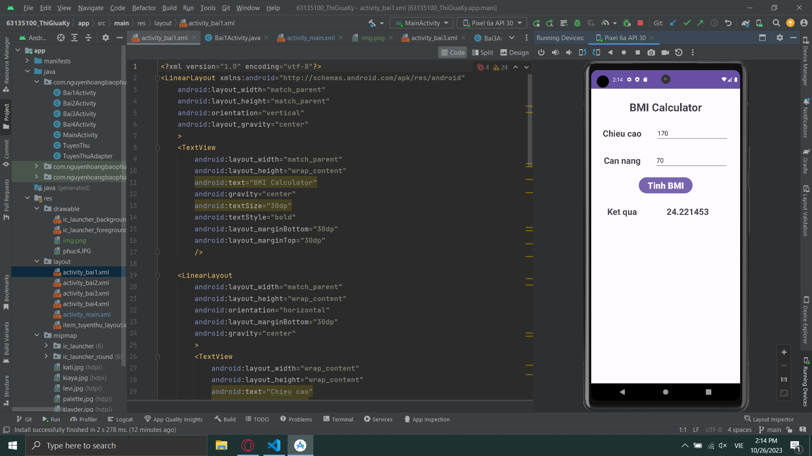
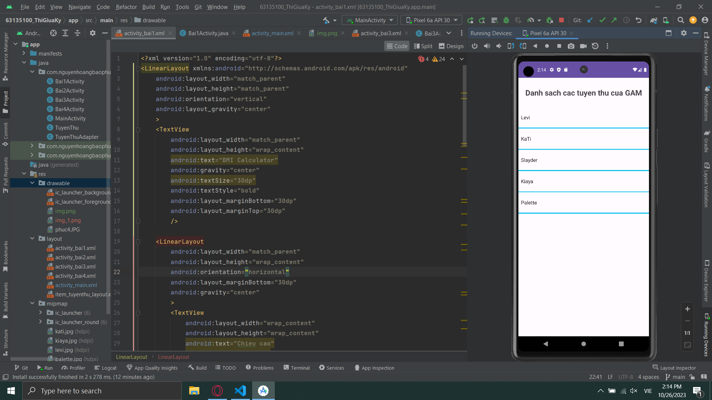
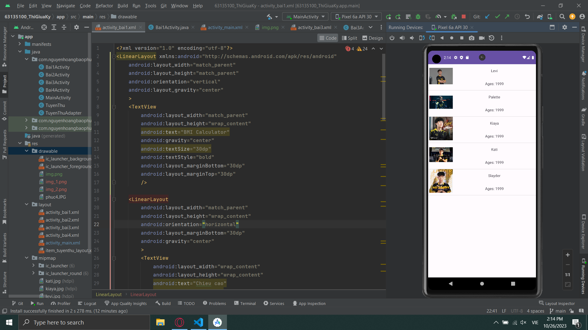
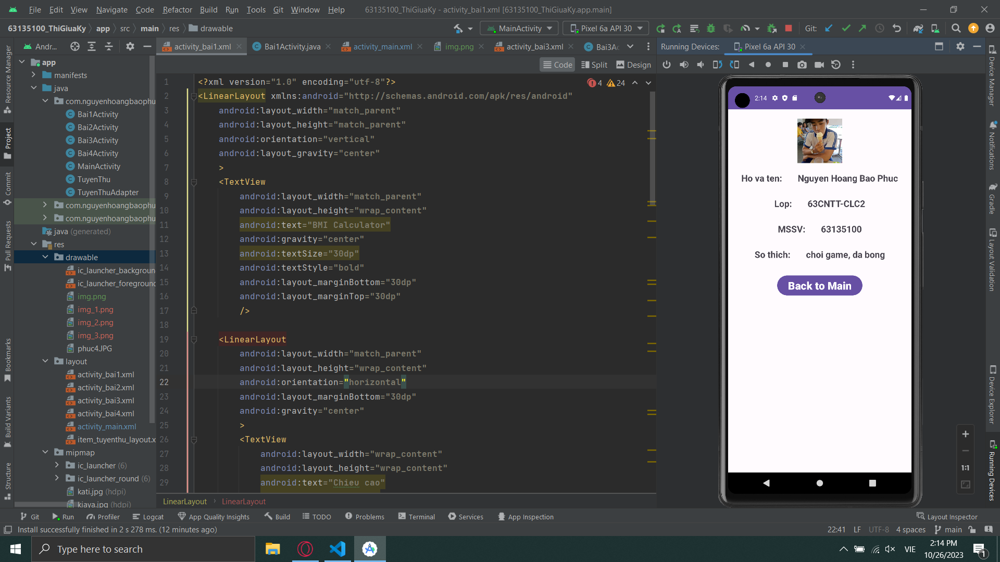
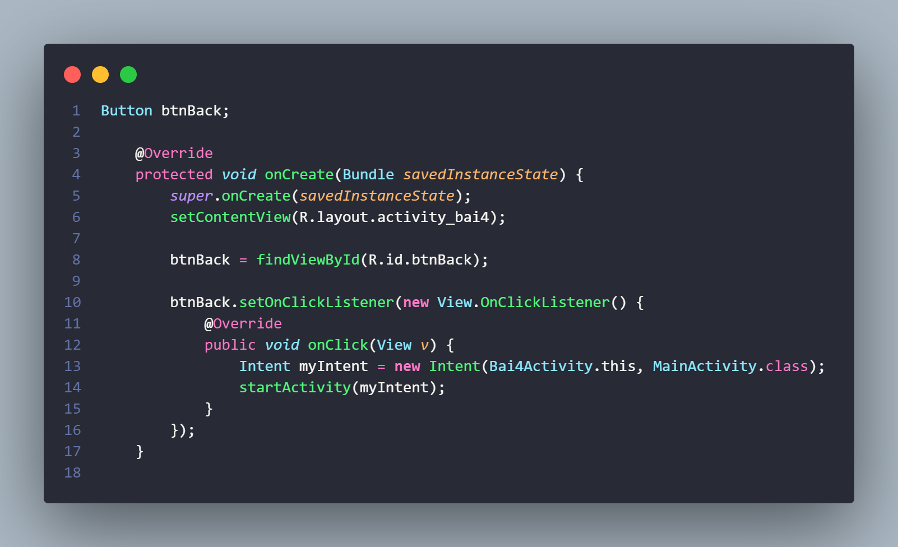

### 1. Câu 1.
- Yêu cầu là viết 1 màn hình với chức năng là tính BMI, vẫn là nhập chiều cao và cân nặng để tính ra BMI theo công thức BMI = nặng/(cao*cao) với chiều cao tính bằng mét và câng nặng là kg

### 2. Câu 2.
- Sử dụng kiến thức về Listview cơ bản để tạo 1 màn hình đưa ra 1 danh sách nào đó, ở đây tớ chọn là danh sách các tuyển thủ thi đấu thể thao điện tử của GAM Esport

### 3. Câu 3.
- Cũng là Listview nhưng nâng cao, dùng để tạo màn hình các phần tử mà mỗi phần tử chứa thêm các phần tử khác như ImageView, TextView...
  

### 4. Câu 4.
- Cuối cùng là 1 màn hình hiển thị thông tin cá nhân, đại loại nó giống như AboutMe tớ đã từng up.
  
- Điểm khác biệt là sẽ có thêm 1 button "Back to Main", khi ta ấn vào thì ngay lập tức đưa ta về màn hình ban đầu
- Đây là code ở phía Bai4Activity.java về việc chuyển đổi màn hình khi ấn vào button trên
    