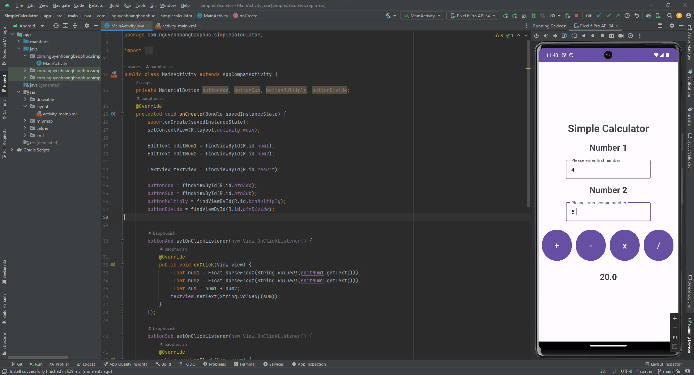

# 63CLC2-MobiDev
Nơi lưu các dự án về Android Studio
## Lưu ý: Các đường dẫn ở các heading dẫn tới file MainActivity.java của từng bài tập

### 1. Chương trình đầu tiên
- Chi tiết bài tập tại [Đây](./HelloWorld/app/src/main/java/com/nguyenhoangbaophuc/helloworld/MainActivity.java)
- Chương trình này là chương trình nền móng để chúng ta tiếp cận với Android Studio

### 2. About me
- Chi tiết bài tập tại [đây](./About/app/src/main/java/com/nguyenhoangbaophuc/about/MainActivity.java)
- Chương trình này giúp ta biết được TextView và ImageView

### 3. Bài tập tính chỉ số BMI
- Chi tiết bài tập tại [đây](./BMI/app/src/main/java/com/nguyenhoangbaophuc/bmi/MainActivity.java)
- Ta cần tick vào check box để biết xem bạn muốn tính BMI cho người ở châu nào, đưa ra được kết quả chính xác cho người dùng
- Khi nhập đầy đủ 2 chỉ số về cân nặng và chiều cao, ta ấn submit để đưa ra kết quả về chỉ số BMI của cơ thể.

### 4. Bài tập Change Something
- Chi tiết bài tập tại [đây](./ChangeSth/app/src/main/java/com/nguyenhoangbaophuc/changesth/MainActivity.java)
- Chúng ta sẽ có đoạn text như trên, khi ta ấn vào dấu cộng thì chữ to dần, ấn trừ thì chữ nhỏ dần

- ở dưới là các button để đổi màu, ta có thể đổi màu ngẫu nhiên qua "Change color random" hoặc chọn 1 màu cụ thể ở dưới.

### 5. Bài tập máy tính đơn giản
- Chi tiết bài tập tại [đây](./SimpleCalculator/app/src/main/java/com/nguyenhoangbaophuc/simplecalculator/MainActivity.java)
- Đầu tiên là ta nhập vào 2 số ở 2 ô bên dưới
- Khi ta nhấn vào 1 trong 4 phép tính bên dưới thì nó sẽ hiện ra kết quả ở trong màn hình

### 6. Bài Listview về các quốc gia
- Chi tiết bài tập tại [đây](./TestListView/app/src/main/java/com/nguyenhoangbaophuc/testlistview/MainActivity.java)
- Ta tạo 1 list về các quốc gia, bao gồm: quốc kì, tên quốc gia và dân số của quốc gia đó
- Vì là bài tập sơ khai của list nên nó chỉ đơn giản là hiện ra 1 list gồm 3 quốc gia là Nga, Việt Nam và Mỹ
  
  